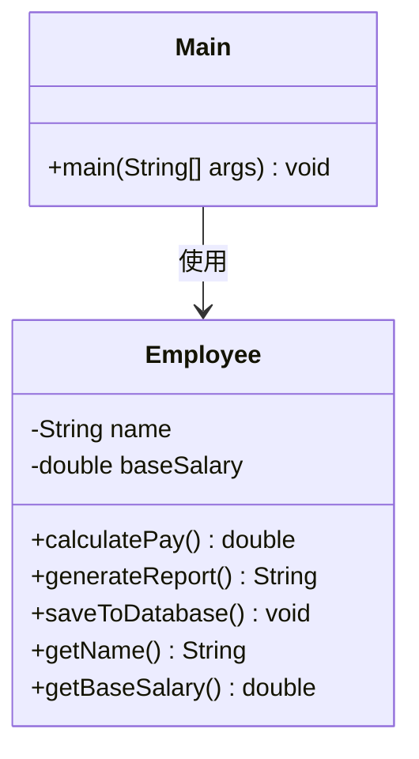
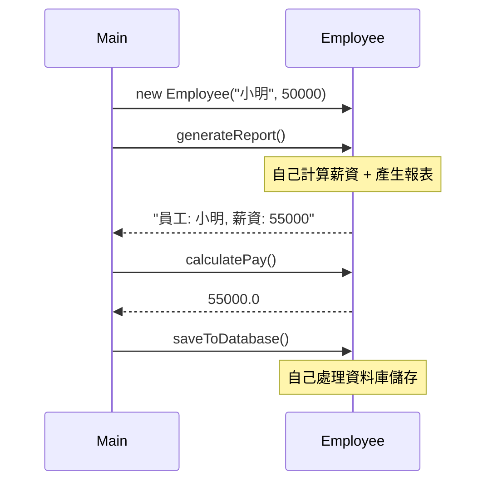
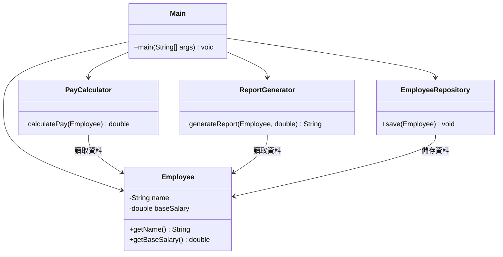
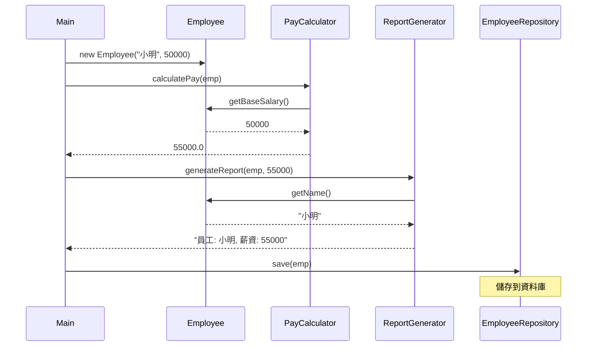

# S — Single Responsibility Principle（單一職責原則）

> **Each unit of code should only have one job or responsibility.**
> 每個程式碼單元應該只有一個職責。

## 核心觀念

一個類別應該**只有一個被修改的理由**。如果一個類別負責了多件事情，當任何一項需求改變時，都必須修改這個類別，增加了引入 bug 的風險。

---

## 情境說明

我們用一個**員工管理系統**來說明 SRP。系統需要：
1. 管理員工基本資料
2. 計算薪資
3. 產生報表
4. 儲存資料到資料庫

---

## Bad Example（違反 SRP）

### 架構圖

```
┌─────────────────────────────────────────┐
│              Employee                    │
│─────────────────────────────────────────│
│  - name: String                          │
│  - baseSalary: double                    │
│─────────────────────────────────────────│
│  + calculatePay(): double        ← 責任1 │
│  + generateReport(): String      ← 責任2 │
│  + saveToDatabase(): void        ← 責任3 │
│  + getName(): String                     │
│  + getBaseSalary(): double               │
└─────────────────────────────────────────┘
         ▲ 一個類別承擔三個職責！
```

### 類別圖 (Mermaid)



### 循序圖 (Mermaid)



### 問題分析

| 問題 | 說明 |
|------|------|
| 修改風險高 | 改薪資邏輯可能影響報表或資料庫 |
| 難以測試 | 測試薪資計算時必須建立完整的 Employee |
| 程式碼膨脹 | 隨需求增加，Employee 會越來越大 |
| 違反 SRP | Employee 有三個「被修改的理由」 |

---

## Good Example（遵循 SRP）

### 架構圖

```
┌──────────────────┐     ┌──────────────────┐
│    Employee       │     │  PayCalculator    │
│──────────────────│     │──────────────────│
│ - name           │     │                  │
│ - baseSalary     │     │ + calculatePay() │
│──────────────────│     └──────────────────┘
│ + getName()      │
│ + getBaseSalary()│     ┌──────────────────┐
└──────────────────┘     │ ReportGenerator   │
                         │──────────────────│
                         │                  │
                         │+ generateReport()│
                         └──────────────────┘

                         ┌──────────────────┐
                         │EmployeeRepository│
                         │──────────────────│
                         │                  │
                         │ + save()         │
                         └──────────────────┘
```

### 類別圖 (Mermaid)



### 循序圖 (Mermaid)



---

## Bad vs Good 比較

| 比較項目 | ❌ Bad（違反 SRP） | ✅ Good（遵循 SRP） |
|---------|-------------------|---------------------|
| 類別數量 | 1 個（Employee 做所有事） | 4 個（各司其職） |
| 修改影響 | 改一處可能影響全部 | 只影響對應的類別 |
| 可測試性 | 難以單獨測試某個功能 | 可獨立測試每個類別 |
| 可重用性 | 低（綁死在 Employee 中） | 高（可在其他地方使用） |
| 團隊協作 | 多人改同一個檔案，容易衝突 | 各改各的，不會衝突 |

## 修改情境模擬

假設需要「把報表格式改成 JSON」：

- **Bad**：修改 `Employee.generateReport()`，有風險影響 `calculatePay()` 和 `saveToDatabase()`
- **Good**：只修改 `ReportGenerator.generateReport()`，其他類別完全不受影響

---

## 程式碼位置

| 語言 | Bad Example | Good Example |
|------|-------------|--------------|
| Java | [java/1-srp/bad/](../java/1-srp/bad/) | [java/1-srp/good/](../java/1-srp/good/) |
| C#   | [dotnet/1-srp/Bad/](../dotnet/1-srp/Bad/) | [dotnet/1-srp/Good/](../dotnet/1-srp/Good/) |

---

## 重點整理

1. **一個類別 = 一個職責 = 一個被修改的理由**
2. 如果你描述一個類別時用到了「而且」，代表它可能有多個職責
3. SRP 不代表每個類別只能有一個方法，而是這些方法應該為同一個目的服務
4. 過度拆分也不好 — 要找到合理的平衡點
