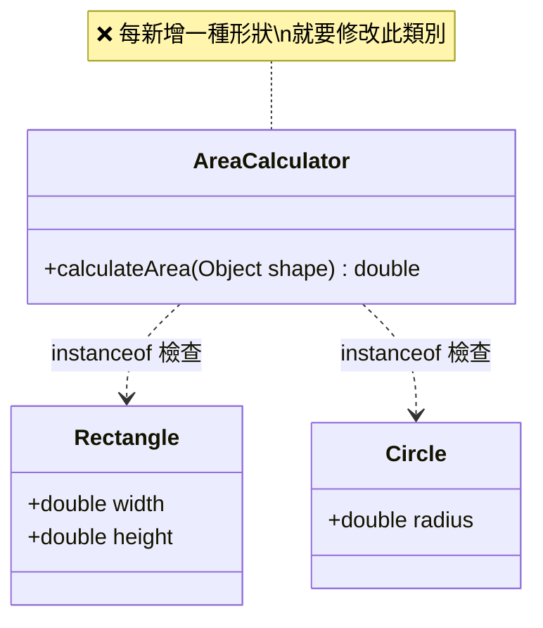
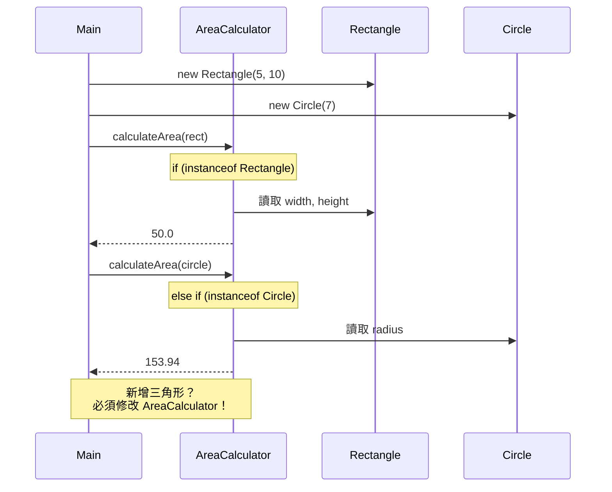
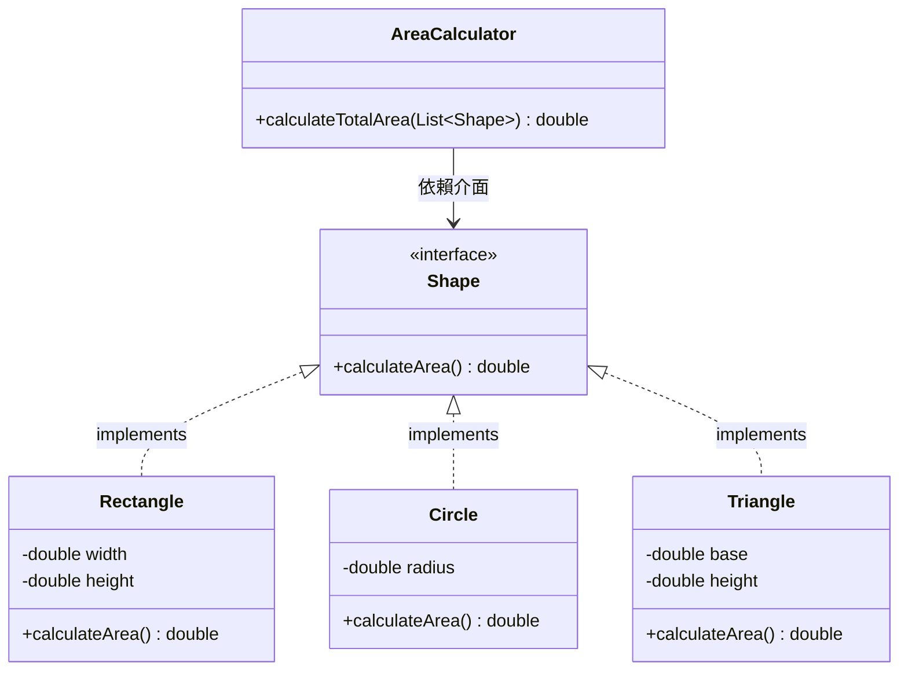
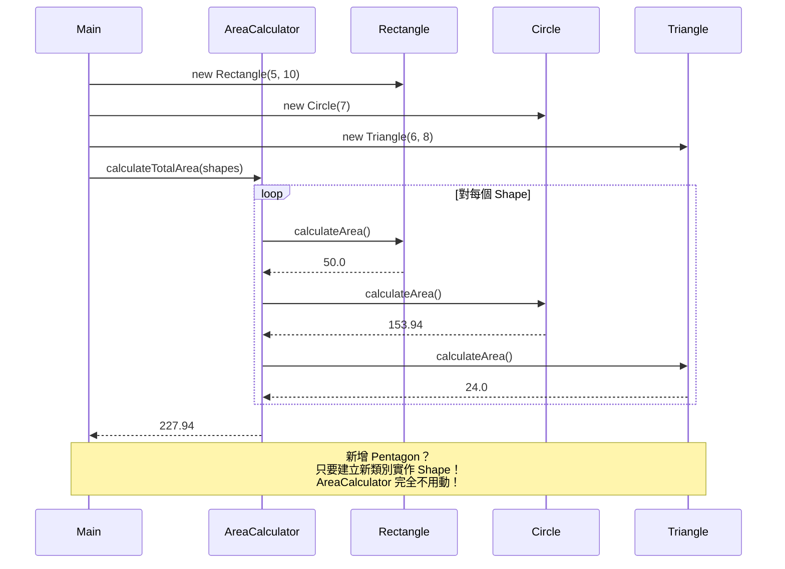

# O — Open/Closed Principle（開放封閉原則）

> **Units of code should be open for extension but closed for modification.**
> 程式碼單元應該對擴展開放、對修改封閉。

## 核心觀念

當需要新增功能時，應該透過**新增程式碼**來擴展，而非**修改現有程式碼**。這樣可以避免在已經測試過、穩定運行的程式碼中引入新的 bug。

---

## 情境說明

我們用一個**面積計算器**來說明 OCP。系統需要：
1. 計算各種形狀的面積（長方形、圓形）
2. 未來可能新增更多形狀（三角形、梯形⋯）

---

## Bad Example（違反 OCP）

### 架構圖

```
┌──────────────┐  ┌──────────────┐
│  Rectangle   │  │    Circle    │
│──────────────│  │──────────────│
│ + width      │  │ + radius     │
│ + height     │  │              │
└──────┬───────┘  └──────┬───────┘
       │                 │
       ▼                 ▼
┌──────────────────────────────────┐
│         AreaCalculator            │
│──────────────────────────────────│
│ + calculateArea(Object shape)     │
│   if (shape instanceof Rectangle) │  ← 每新增形狀
│   else if (shape instanceof Circle)│  ← 就要改這裡！
│   // ❌ 新增三角形？繼續加 else if │
└──────────────────────────────────┘
```

### 類別圖 (Mermaid)



### 循序圖 (Mermaid)



### 問題分析

| 問題 | 說明 |
|------|------|
| 違反 OCP | 新增形狀必須修改 `AreaCalculator` |
| if-else 膨脹 | 隨著形狀增加，判斷邏輯越來越長 |
| 使用 instanceof | 失去了多型的好處 |
| 容易遺漏 | 忘記加 else if 會導致回傳 0 |

---

## Good Example（遵循 OCP）

### 架構圖

```
          ┌─────────────────┐
          │   «interface»   │
          │     Shape        │
          │─────────────────│
          │+ calculateArea()│
          └────────┬────────┘
                   │ implements
       ┌───────────┼───────────┐
       ▼           ▼           ▼
┌────────────┐┌──────────┐┌──────────┐
│ Rectangle  ││  Circle  ││ Triangle │  ← 新增形狀只要
│────────────││──────────││──────────│    新增類別！
│- width     ││- radius  ││- base    │
│- height    ││          ││- height  │
│────────────││──────────││──────────│
│+calculate  ││+calculate││+calculate│
│ Area()     ││ Area()   ││ Area()   │
└────────────┘└──────────┘└──────────┘

┌──────────────────────────────────┐
│         AreaCalculator            │
│──────────────────────────────────│
│+ calculateTotalArea(List<Shape>) │
│   → 只依賴 Shape 介面             │
│   → 完全不需要修改！               │
└──────────────────────────────────┘
```

### 類別圖 (Mermaid)



### 循序圖 (Mermaid)



---

## Bad vs Good 比較

| 比較項目 | ❌ Bad（違反 OCP） | ✅ Good（遵循 OCP） |
|---------|-------------------|---------------------|
| 新增形狀 | 修改 `AreaCalculator` 的 if-else | 新增一個 `Shape` 實作類別即可 |
| 型別安全 | 使用 `Object`，無編譯期檢查 | 使用 `Shape` 介面，編譯期保證 |
| 既有程式碼 | 每次新增都要改 | 永遠不用修改 |
| 測試範圍 | 每次修改都要重新測試整個 Calculator | 只需測試新增的形狀 |
| 維護成本 | 隨形狀數量線性增長 | 維持穩定 |

## 擴展模擬

假設需要新增「梯形 (Trapezoid)」：

**Bad**：
```java
// 必須修改 AreaCalculator.java
else if (shape instanceof Trapezoid) {
    Trapezoid t = (Trapezoid) shape;
    return (t.topWidth + t.bottomWidth) * t.height / 2;
}
```

**Good**：
```java
// 只需新增一個檔案 Trapezoid.java
public class Trapezoid implements Shape {
    // ... 建構子與欄位 ...
    @Override
    public double calculateArea() {
        return (topWidth + bottomWidth) * height / 2;
    }
}
// AreaCalculator 完全不用動！
```

---

## 程式碼位置

| 語言 | Bad Example | Good Example |
|------|-------------|--------------|
| Java | [java/2-ocp/bad/](../java/2-ocp/bad/) | [java/2-ocp/good/](../java/2-ocp/good/) |
| C#   | [dotnet/2-ocp/Bad/](../dotnet/2-ocp/Bad/) | [dotnet/2-ocp/Good/](../dotnet/2-ocp/Good/) |

---

## 重點整理

1. **對擴展開放** — 新增功能時透過新增程式碼完成
2. **對修改封閉** — 已有的程式碼不需要改動
3. 關鍵技術：使用**介面 (Interface)** 或**抽象類別 (Abstract Class)** 定義契約
4. 實務上，OCP 常與**策略模式 (Strategy Pattern)** 搭配使用
5. 如果你發現程式碼中有大量的 `if-else` 或 `switch` 判斷型別，很可能就是違反了 OCP
