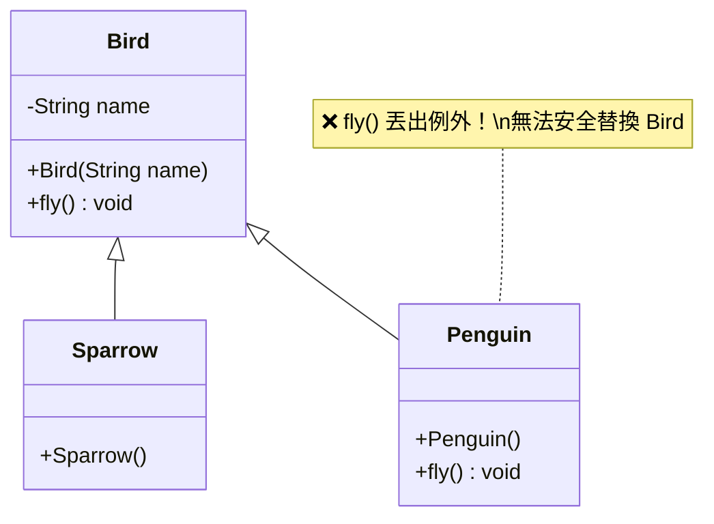
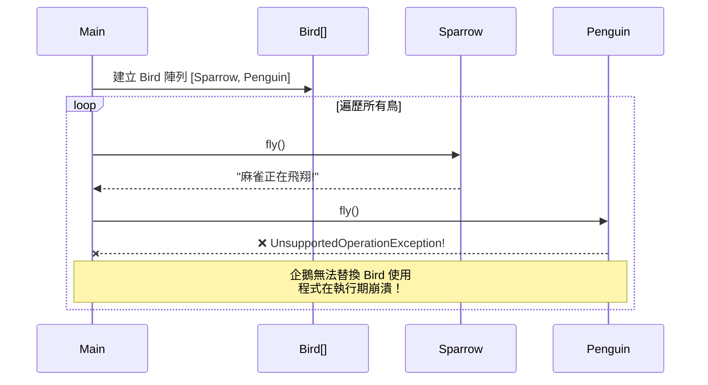
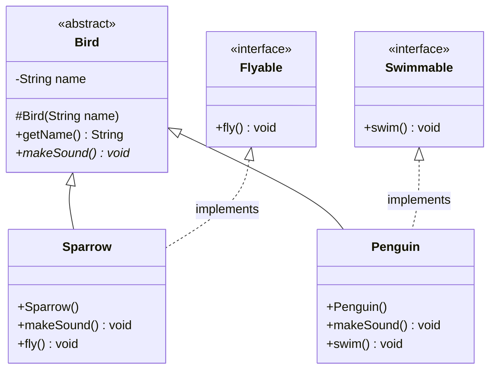
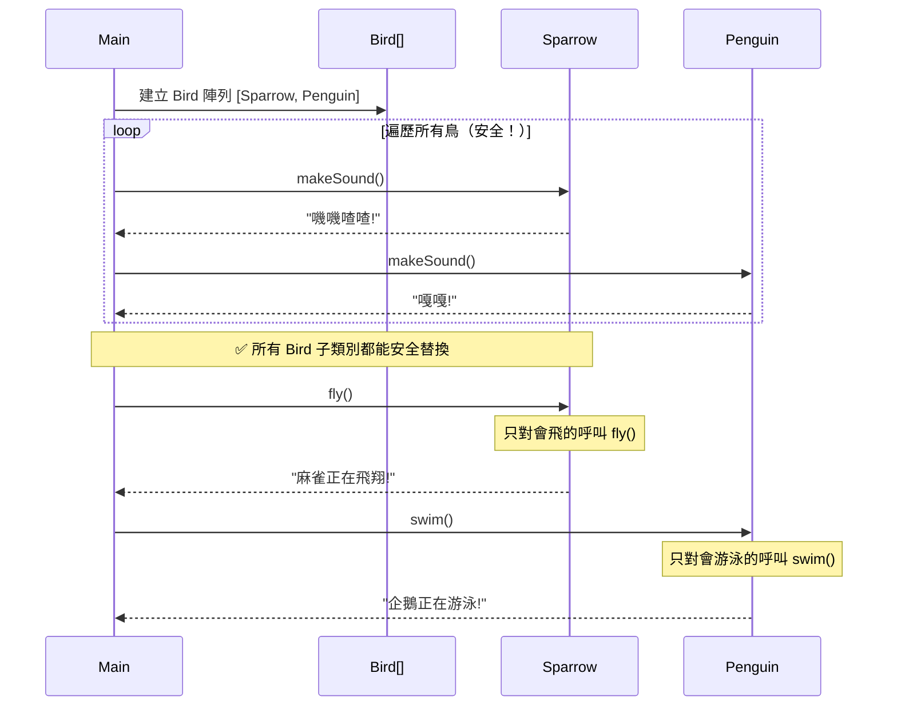

# L — Liskov Substitution Principle（里氏替換原則）

> **You should be able to substitute objects of a base class with objects of its subclass without altering the correctness of the program.**
> 子類別應該可以替換父類別，而不影響程式的正確性。

## 核心觀念

如果 S 是 T 的子類別，那麼 T 類型的物件可以被 S 類型的物件替換，**程式行為不會出錯**。違反 LSP 通常代表繼承關係的設計有問題 — 子類別並不真正「是一種」父類別。

---

## 情境說明

我們用**鳥類系統**來說明 LSP：
- 麻雀 (Sparrow) — 會飛、會叫
- 企鵝 (Penguin) — 會游泳、會叫，但**不會飛**

問題：如果 `Bird` 基底類別有 `fly()` 方法，企鵝怎麼辦？

---

## Bad Example（違反 LSP）

### 架構圖

```
        ┌──────────────────┐
        │      Bird         │
        │──────────────────│
        │ - name           │
        │──────────────────│
        │ + fly()  ← ❌     │
        └────────┬─────────┘
                 │ extends
        ┌────────┴────────┐
        ▼                 ▼
┌──────────────┐  ┌──────────────┐
│   Sparrow    │  │   Penguin    │
│──────────────│  │──────────────│
│              │  │ + fly()      │
│ fly() ✅ OK  │  │  → throw ❌  │
│              │  │  Exception!  │
└──────────────┘  └──────────────┘
```

### 類別圖 (Mermaid)



### 循序圖 (Mermaid)



### 問題分析

| 問題 | 說明 |
|------|------|
| 執行期例外 | 呼叫 `penguin.fly()` 會丟出例外 |
| 需要 try-catch | 呼叫端必須處理可能的例外 |
| 破壞多型 | 無法把所有 Bird 統一處理 |
| 繼承設計錯誤 | 不是所有鳥都會飛，不應放在 Bird 中 |

---

## Good Example（遵循 LSP）

### 架構圖

```
        ┌──────────────────┐
        │  «abstract»      │
        │      Bird         │
        │──────────────────│
        │ - name           │
        │──────────────────│
        │ + makeSound() ✅  │  ← 只有共同行為
        └────────┬─────────┘
                 │ extends
        ┌────────┴────────┐
        ▼                 ▼
┌──────────────┐  ┌──────────────┐
│   Sparrow    │  │   Penguin    │
│──────────────│  │──────────────│
│+ makeSound() │  │+ makeSound() │
│+ fly()    ✅ │  │+ swim()   ✅ │
└──────────────┘  └──────────────┘
        │                 │
   implements        implements
        │                 │
        ▼                 ▼
┌──────────────┐  ┌──────────────┐
│ «interface»  │  │ «interface»  │
│   Flyable    │  │  Swimmable   │
│──────────────│  │──────────────│
│ + fly()      │  │ + swim()     │
└──────────────┘  └──────────────┘
```

### 類別圖 (Mermaid)



### 循序圖 (Mermaid)



---

## Bad vs Good 比較

| 比較項目 | ❌ Bad（違反 LSP） | ✅ Good（遵循 LSP） |
|---------|-------------------|---------------------|
| Bird.fly() | 所有鳥都有，企鵝丟例外 | Bird 只有 makeSound() |
| 替換安全性 | Penguin 無法安全替換 Bird | 所有子類別都能安全替換 |
| 錯誤發現時機 | 執行期（Runtime）才崩潰 | 編譯期（Compile-time）就發現 |
| 能力分離 | 沒有分離 | Flyable 和 Swimmable 獨立 |
| 呼叫端複雜度 | 需要 try-catch 或 instanceof 檢查 | 直接呼叫，無需額外判斷 |

## 如何判斷是否違反 LSP？

以下跡象代表可能違反了 LSP：

```
❌ 子類別的方法丟出「不支援」的例外
❌ 子類別的方法什麼都不做（空實作）
❌ 呼叫端需要用 instanceof 判斷型別再決定行為
❌ 子類別覆寫方法時改變了原本的語意
```

---

## 程式碼位置

| 語言 | Bad Example | Good Example |
|------|-------------|--------------|
| Java | [java/3-lsp/bad/](../java/3-lsp/bad/) | [java/3-lsp/good/](../java/3-lsp/good/) |
| C#   | [dotnet/3-lsp/Bad/](../dotnet/3-lsp/Bad/) | [dotnet/3-lsp/Good/](../dotnet/3-lsp/Good/) |

---

## 重點整理

1. **子類別必須能完全替換父類別**，不會導致程式出錯
2. 如果子類別需要丟例外或空實作來「繞過」父類別的方法，就是違反 LSP
3. 解法：將不屬於所有子類別的行為抽到**介面**中
4. LSP 鼓勵使用**組合 (Composition)** 而非不當的**繼承 (Inheritance)**
5. 設計繼承時問自己：「所有子類別都真的具備這個行為嗎？」
