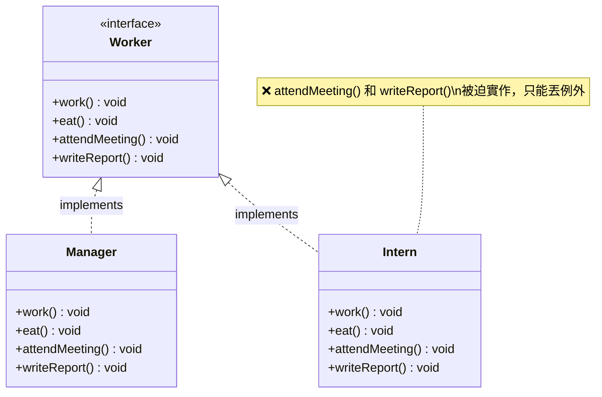
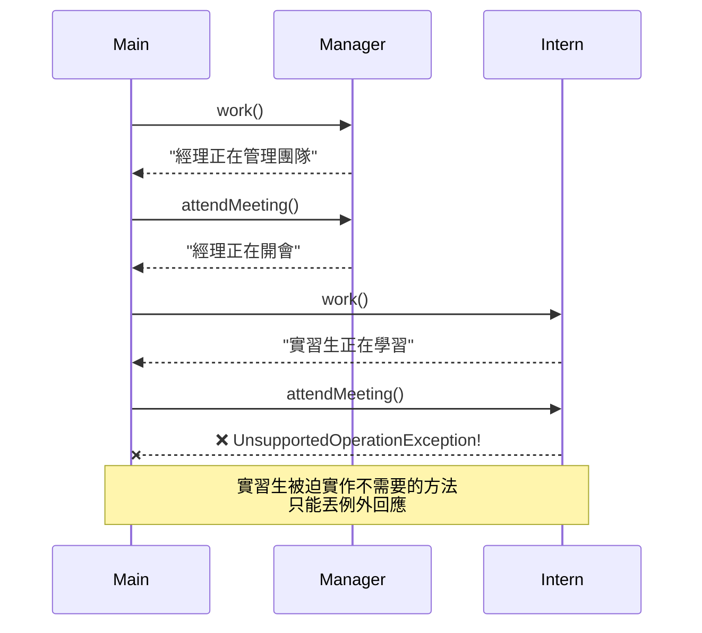
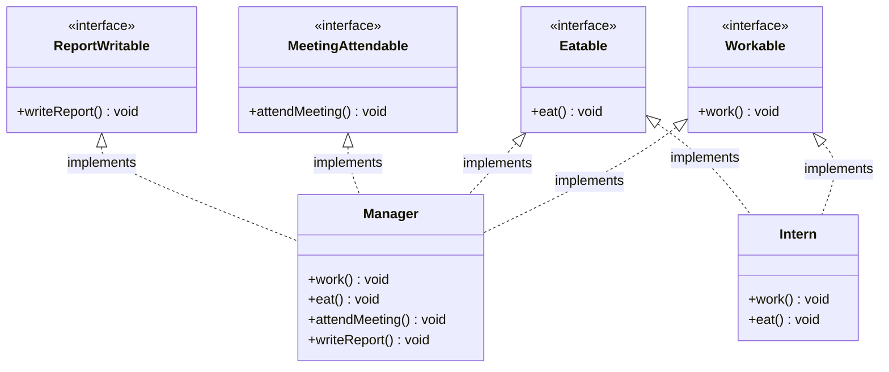
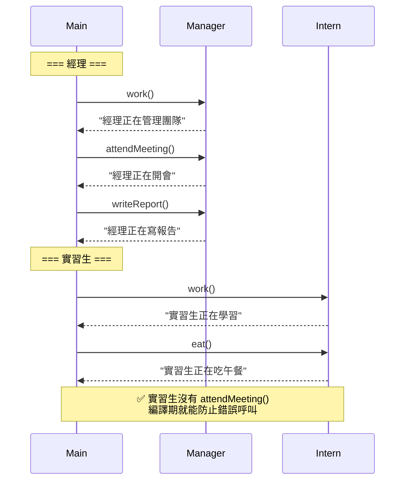

# I — Interface Segregation Principle（介面隔離原則）

> **Provide multiple interfaces with specific responsibilities rather than a small set of general-purpose interfaces.**
> 提供多個專一的小介面，而非少數幾個大而全的通用介面。

## 核心觀念

客戶端不應該被迫依賴它不需要的方法。如果一個介面太「胖」，實作者就會被迫實作一堆與自己無關的方法，違反了 ISP。解決方法是將大介面拆分成多個小介面。

---

## 情境說明

我們用**公司員工角色系統**來說明 ISP：
- **經理 (Manager)**：工作、吃飯、開會、寫報告
- **實習生 (Intern)**：工作、吃飯（不需要開會、不需要寫報告）

---

## Bad Example（違反 ISP）

### 架構圖

```
┌────────────────────────────────┐
│        «interface»             │
│          Worker                │
│────────────────────────────────│
│ + work()                       │
│ + eat()                        │
│ + attendMeeting()   ← 不是每個人 │
│ + writeReport()     ← 都需要！   │
└──────────────┬─────────────────┘
               │ implements
       ┌───────┴───────┐
       ▼               ▼
┌──────────────┐ ┌──────────────┐
│   Manager    │ │    Intern    │
│──────────────│ │──────────────│
│ work() ✅    │ │ work() ✅    │
│ eat() ✅     │ │ eat() ✅     │
│ attendMtg ✅ │ │ attendMtg ❌ │ ← throw Exception!
│ writeRpt ✅  │ │ writeRpt ❌  │ ← throw Exception!
└──────────────┘ └──────────────┘
```

### 類別圖 (Mermaid)



### 循序圖 (Mermaid)



### 問題分析

| 問題 | 說明 |
|------|------|
| 胖介面 | `Worker` 包含了不是所有人都需要的方法 |
| 空實作/例外 | Intern 被迫實作 `attendMeeting()` 和 `writeReport()` |
| 執行期錯誤 | 呼叫端不知道某些方法會丟例外 |
| 違反 LSP | Intern 無法安全替換 Worker 使用 |

---

## Good Example（遵循 ISP）

### 架構圖

```
┌──────────────┐ ┌──────────────┐ ┌────────────────┐ ┌───────────────┐
│ «interface»  │ │ «interface»  │ │  «interface»   │ │ «interface»   │
│  Workable    │ │   Eatable    │ │MeetingAttendable│ │ReportWritable │
│──────────────│ │──────────────│ │────────────────│ │───────────────│
│ + work()     │ │ + eat()      │ │+attendMeeting()│ │+writeReport() │
└──────┬───────┘ └──────┬───────┘ └───────┬────────┘ └──────┬────────┘
       │                │                 │                  │
       │    implements  │                 │                  │
       ▼                ▼                 ▼                  ▼
┌──────────────────────────────────────────────────────────────────┐
│                          Manager                                 │
│ implements: Workable, Eatable, MeetingAttendable, ReportWritable │
└──────────────────────────────────────────────────────────────────┘

       │                │
       │    implements  │
       ▼                ▼
┌──────────────────────────────┐
│            Intern            │
│  implements: Workable, Eatable│  ← 只實作需要的！
└──────────────────────────────┘
```

### 類別圖 (Mermaid)



### 循序圖 (Mermaid)



---

## Bad vs Good 比較

| 比較項目 | ❌ Bad（違反 ISP） | ✅ Good（遵循 ISP） |
|---------|-------------------|---------------------|
| 介面數量 | 1 個大介面 (4 個方法) | 4 個小介面 (各 1 個方法) |
| Intern 實作 | 被迫實作 4 個方法（2 個丟例外） | 只實作 2 個需要的介面 |
| 錯誤防護 | 執行期才發現（例外） | 編譯期就防止 |
| 新增角色 | 可能又有不需要的方法 | 自由組合需要的介面 |
| 程式碼品質 | 有空實作或例外方法 | 每個方法都有意義 |

## 新增角色模擬

假設新增「遠端工作者 (RemoteWorker)」— 工作、寫報告，但不到公司吃飯和開會：

**Bad**：
```java
public class RemoteWorker implements Worker {
    public void work() { /* ✅ */ }
    public void eat() { throw new UnsupportedOperationException(); }      // ❌
    public void attendMeeting() { throw new UnsupportedOperationException(); } // ❌
    public void writeReport() { /* ✅ */ }
}
```

**Good**：
```java
public class RemoteWorker implements Workable, ReportWritable {
    public void work() { System.out.println("遠端工作中"); }      // ✅
    public void writeReport() { System.out.println("撰寫報告"); } // ✅
    // 不需要 eat() 和 attendMeeting()！
}
```

---

## 程式碼位置

| 語言 | Bad Example | Good Example |
|------|-------------|--------------|
| Java | [java/4-isp/bad/](../java/4-isp/bad/) | [java/4-isp/good/](../java/4-isp/good/) |
| C#   | [dotnet/4-isp/Bad/](../dotnet/4-isp/Bad/) | [dotnet/4-isp/Good/](../dotnet/4-isp/Good/) |

---

## 重點整理

1. **介面應該小而專一**，不要把所有方法塞到一個介面裡
2. 如果實作類別需要空實作或丟例外，代表介面太胖了
3. 寧可有多個小介面，也不要一個大介面
4. ISP 讓新增角色時可以**自由組合**需要的能力
5. ISP 與 SRP 相輔相成 — SRP 針對類別，ISP 針對介面
