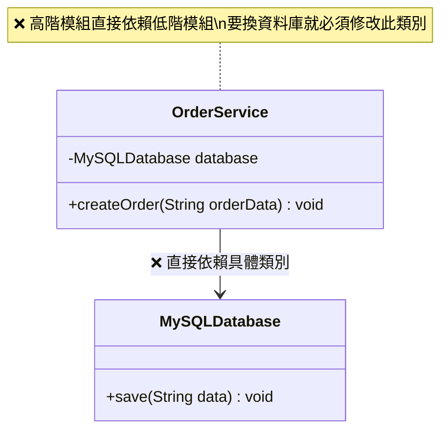
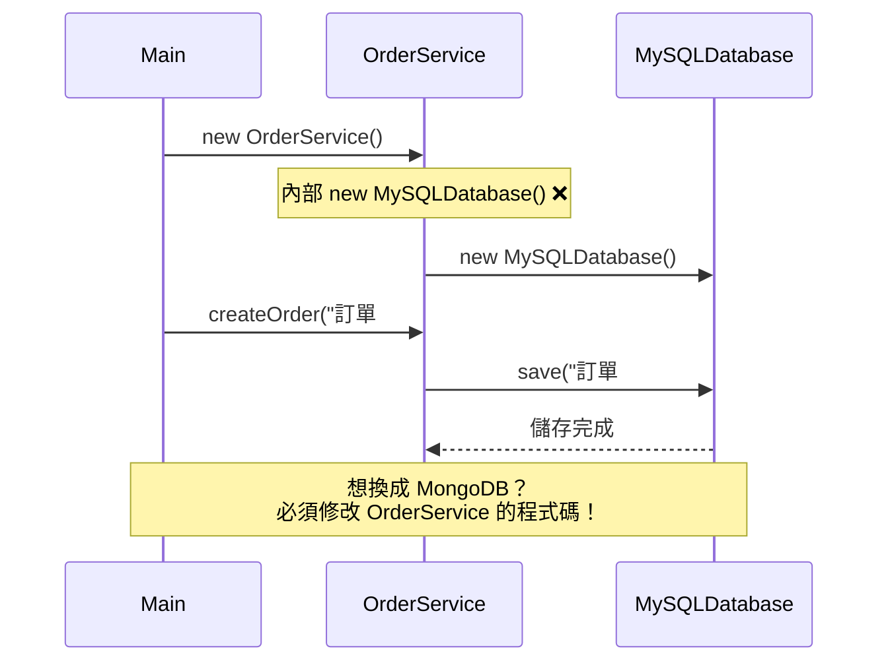
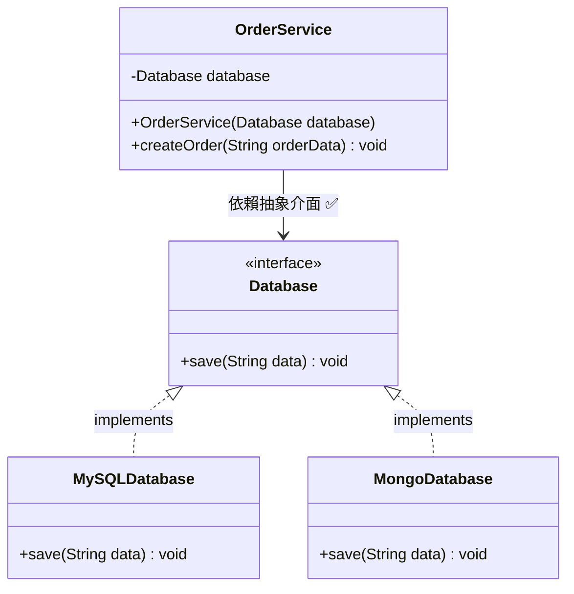
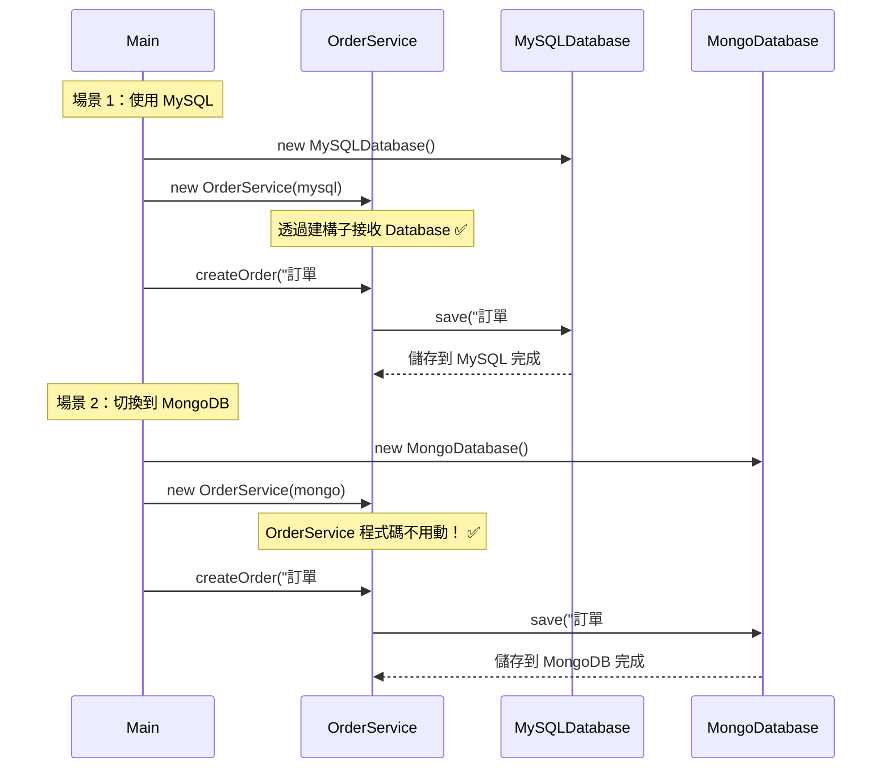

# D — Dependency Inversion Principle（依賴反轉原則）

> **High-level modules shouldn't depend on low-level modules. Both should depend on abstractions.**
> 高階模組不應該依賴低階模組，兩者都應該依賴抽象。

## 核心觀念

- **高階模組**（業務邏輯）不應直接依賴**低階模組**（基礎設施）
- 兩者都應該依賴**抽象**（介面或抽象類別）
- 抽象不應依賴細節，細節應該依賴抽象

DIP 是實現「鬆耦合」的關鍵原則，也是依賴注入 (Dependency Injection) 的理論基礎。

---

## 情境說明

我們用**訂單系統**來說明 DIP：
- **OrderService**（高階模組）：處理訂單建立
- **MySQLDatabase**（低階模組）：負責資料儲存
- 未來可能要換成 MongoDB 或其他資料庫

---

## Bad Example（違反 DIP）

### 架構圖

```
    高階模組                    低階模組
┌──────────────────┐     ┌──────────────────┐
│   OrderService   │────▶│  MySQLDatabase   │
│──────────────────│     │──────────────────│
│ - database =     │     │ + save(data)     │
│   new MySQL()  ❌│     │                  │
│──────────────────│     └──────────────────┘
│ + createOrder()  │
└──────────────────┘
         │
    直接依賴具體實作
    換資料庫就要改 OrderService！
```

### 類別圖 (Mermaid)



### 循序圖 (Mermaid)



### 問題分析

| 問題 | 說明 |
|------|------|
| 緊耦合 | OrderService 與 MySQLDatabase 綁死 |
| 難以替換 | 換資料庫必須改 OrderService |
| 難以測試 | 無法用 Mock 資料庫測試 OrderService |
| 違反 OCP | 新增資料庫支援要修改現有程式碼 |

---

## Good Example（遵循 DIP）

### 架構圖

```
    高階模組              抽象層                  低階模組
┌──────────────┐   ┌──────────────┐   ┌──────────────────┐
│ OrderService │──▶│ «interface»  │◀──│  MySQLDatabase   │
│──────────────│   │   Database   │   │──────────────────│
│ - database:  │   │──────────────│   │ + save(data)     │
│   Database   │   │ + save(data) │   └──────────────────┘
│──────────────│   └──────────────┘
│+createOrder()│          ▲           ┌──────────────────┐
└──────────────┘          │           │  MongoDatabase   │
                          └───────────│──────────────────│
                                      │ + save(data)     │
                                      └──────────────────┘

      ✅ 高階和低階都依賴抽象介面！
```

### 類別圖 (Mermaid)



### 循序圖 (Mermaid)



---

## 依賴方向對比圖

### Bad — 依賴方向向下

```
        ┌────────────────┐
        │  OrderService  │  高階模組
        │  (業務邏輯)     │
        └───────┬────────┘
                │ 依賴 ↓
        ┌───────▼────────┐
        │ MySQLDatabase  │  低階模組
        │  (基礎設施)     │
        └────────────────┘

   ❌ 高階直接依賴低階 → 緊耦合
```

### Good — 依賴方向反轉

```
        ┌────────────────┐
        │  OrderService  │  高階模組
        │  (業務邏輯)     │
        └───────┬────────┘
                │ 依賴 ↓
        ┌───────▼────────┐
        │   «interface»  │  抽象層
        │    Database     │
        └───────▲────────┘
                │ 依賴 ↑（反轉！）
        ┌───────┴────────┐
        │ MySQLDatabase  │  低階模組
        │  (基礎設施)     │
        └────────────────┘

   ✅ 低階依賴抽象 → 鬆耦合
      (依賴方向反轉了！)
```

---

## Bad vs Good 比較

| 比較項目 | ❌ Bad（違反 DIP） | ✅ Good（遵循 DIP） |
|---------|-------------------|---------------------|
| 依賴方向 | OrderService → MySQLDatabase | OrderService → Database ← MySQLDatabase |
| 耦合程度 | 緊耦合（綁死 MySQL） | 鬆耦合（依賴介面） |
| 替換資料庫 | 必須修改 OrderService | 只需新增實作類別 |
| 單元測試 | 難以 Mock | 輕鬆注入 MockDatabase |
| 依賴注入 | 不支援 | 透過建構子注入 |

## 測試便利性

遵循 DIP 後，可以輕鬆建立 Mock 進行單元測試：

```java
// 測試用的 Mock Database
public class MockDatabase implements Database {
    public List<String> savedData = new ArrayList<>();

    @Override
    public void save(String data) {
        savedData.add(data);  // 記錄呼叫，不實際存資料庫
    }
}

// 測試程式碼
MockDatabase mockDb = new MockDatabase();
OrderService service = new OrderService(mockDb);
service.createOrder("測試訂單");
assert mockDb.savedData.contains("測試訂單"); // ✅ 輕鬆驗證
```

---

## 程式碼位置

| 語言 | Bad Example | Good Example |
|------|-------------|--------------|
| Java | [java/5-dip/bad/](../java/5-dip/bad/) | [java/5-dip/good/](../java/5-dip/good/) |
| C#   | [dotnet/5-dip/Bad/](../dotnet/5-dip/Bad/) | [dotnet/5-dip/Good/](../dotnet/5-dip/Good/) |

---

## 重點整理

1. **高階模組和低階模組都應該依賴抽象**
2. 「反轉」指的是低階模組的依賴方向被反轉 — 不再是高階依賴低階，而是低階依賴抽象
3. **建構子注入 (Constructor Injection)** 是最常見的依賴注入方式
4. DIP 是 Spring (Java) 和 ASP.NET Core (C#) 中 DI Container 的理論基礎
5. DIP 讓程式碼更容易測試 — 可以注入 Mock 物件
6. DIP 與 OCP 相輔相成 — 依賴抽象才能做到對擴展開放、對修改封閉
