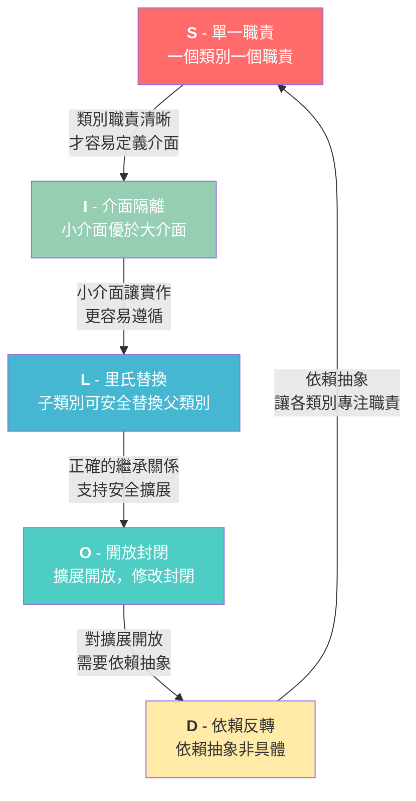

# SOLID Principles Tutorial

SOLID 是物件導向設計中五個重要的設計原則，幫助開發者寫出更好維護、更有彈性的程式碼。

本教學提供 **Java** 與 **.NET Core (C#)** 兩種語言的範例，每個原則都包含：
- **Bad Example（違反原則）**：展示不良設計
- **Good Example（遵循原則）**：展示正確設計
- **README.md**：架構圖、類別圖、循序圖、詳細解說與優劣比較

## 五大原則

| 原則 | 全名 | 核心概念 | 範例情境 | 詳細說明 |
|------|------|----------|---------|---------|
| **S** | Single Responsibility Principle | 每個類別只負責一件事 | 員工管理系統 | [README](1-srp/README.md) |
| **O** | Open/Closed Principle | 對擴展開放，對修改封閉 | 面積計算器 | [README](2-ocp/README.md) |
| **L** | Liskov Substitution Principle | 子類別可以替換父類別 | 鳥類系統 | [README](3-lsp/README.md) |
| **I** | Interface Segregation Principle | 介面應該小而專一 | 員工角色系統 | [README](4-isp/README.md) |
| **D** | Dependency Inversion Principle | 依賴抽象，不依賴具體實作 | 訂單系統 | [README](5-dip/README.md) |

## SOLID 原則關係總覽



## 專案結構

```
├── 1-srp/README.md         # S 原則：詳細解說、架構圖、類別圖、循序圖
├── 2-ocp/README.md         # O 原則：詳細解說、架構圖、類別圖、循序圖
├── 3-lsp/README.md         # L 原則：詳細解說、架構圖、類別圖、循序圖
├── 4-isp/README.md         # I 原則：詳細解說、架構圖、類別圖、循序圖
├── 5-dip/README.md         # D 原則：詳細解說、架構圖、類別圖、循序圖
│
├── java/
│   ├── 1-srp/              # 員工管理系統 (Employee, PayCalculator...)
│   │   ├── bad/            #   違反 SRP 的寫法
│   │   └── good/           #   遵循 SRP 的寫法
│   ├── 2-ocp/              # 面積計算器 (Shape, AreaCalculator...)
│   │   ├── bad/
│   │   └── good/
│   ├── 3-lsp/              # 鳥類系統 (Bird, Flyable, Swimmable...)
│   │   ├── bad/
│   │   └── good/
│   ├── 4-isp/              # 員工角色 (Workable, Eatable...)
│   │   ├── bad/
│   │   └── good/
│   └── 5-dip/              # 訂單系統 (Database, OrderService...)
│       ├── bad/
│       └── good/
│
├── dotnet/
│   ├── 1-srp/              # 同上，C# 版本
│   │   ├── Bad/
│   │   └── Good/
│   ├── 2-ocp/
│   │   ├── Bad/
│   │   └── Good/
│   ├── 3-lsp/
│   │   ├── Bad/
│   │   └── Good/
│   ├── 4-isp/
│   │   ├── Bad/
│   │   └── Good/
│   └── 5-dip/
│       ├── Bad/
│       └── Good/
```

## 如何使用

### Java
```bash
cd java/1-srp
javac bad/*.java
java bad.Main

javac good/*.java
java good.Main
```

### .NET Core (C#)
```bash
cd dotnet/1-srp
dotnet run --project Bad
dotnet run --project Good
```

## 每個原則的文件內容

每個原則的 README.md 都包含以下內容：

| 內容 | 說明 |
|------|------|
| 架構圖 (ASCII) | 直覺展示類別之間的關係 |
| 類別圖 (Mermaid) | UML 類別圖，展示屬性、方法和繼承關係 |
| 循序圖 (Mermaid) | 展示執行流程中物件之間的互動 |
| Bad vs Good 比較表 | 從多個維度對比優劣 |
| 問題分析 | 違反原則時會有什麼問題 |
| 擴展/修改模擬 | 實際模擬需求變更時兩種寫法的差異 |
| 重點整理 | 快速複習該原則的核心觀念 |

> **Mermaid 圖表** 可在 GitHub、GitLab、VS Code（安裝 Mermaid 套件）中直接渲染。

## 學習建議

1. 按照 S → O → L → I → D 的順序閱讀每個原則的 README
2. 先閱讀架構圖和類別圖，理解整體設計
3. 對照 Bad Example 的程式碼，理解為什麼這樣設計會有問題
4. 再對照 Good Example 的程式碼，了解如何改善
5. 閱讀循序圖，了解執行時期的互動流程
6. 嘗試自己修改或擴展範例程式碼（例如新增一個形狀或角色）

## 核心模式

跨越五大原則，你會看到一個反覆出現的設計模式：

> **組合優於繼承 (Composition over Inheritance)**

- **SRP**：將職責分到不同類別（組合）
- **OCP**：透過介面擴展而非修改
- **LSP**：用介面取代不當的繼承
- **ISP**：小介面讓類別自由組合能力
- **DIP**：透過介面注入依賴
